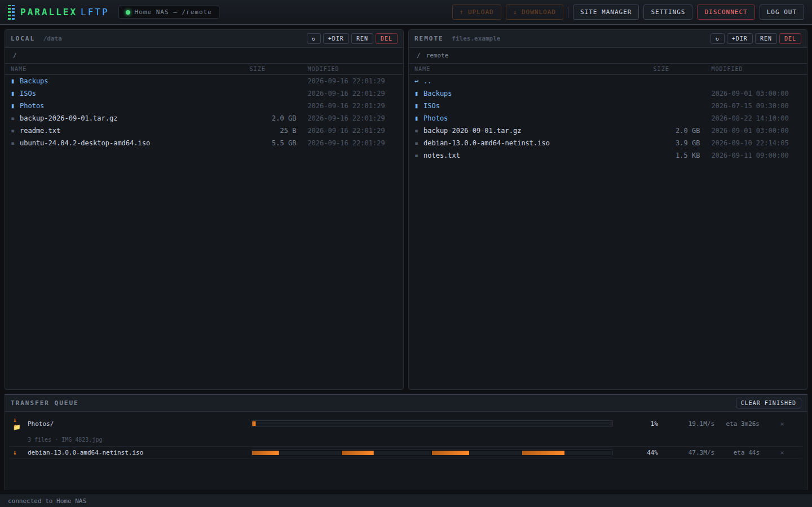
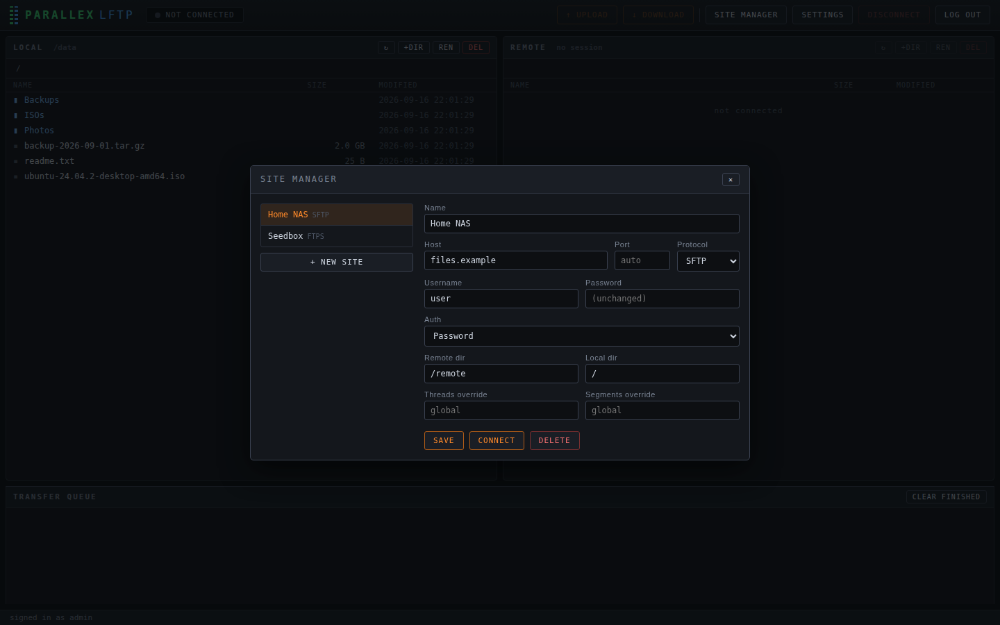
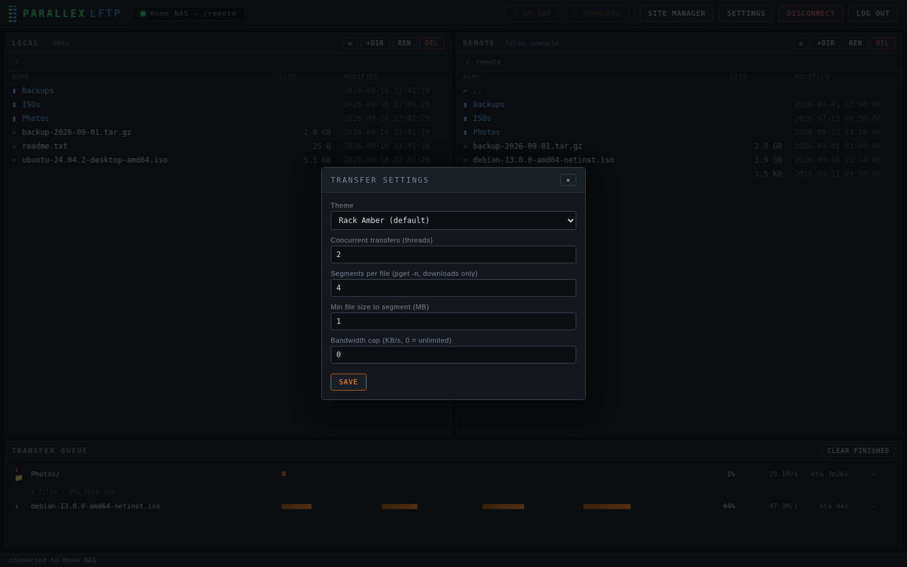
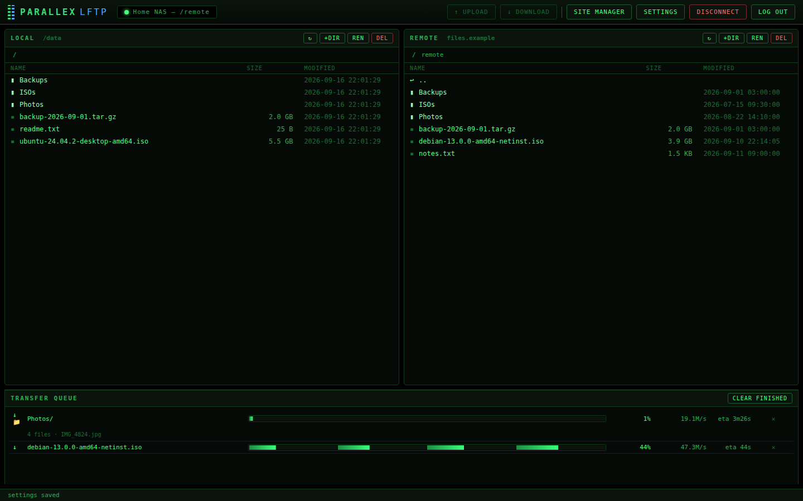
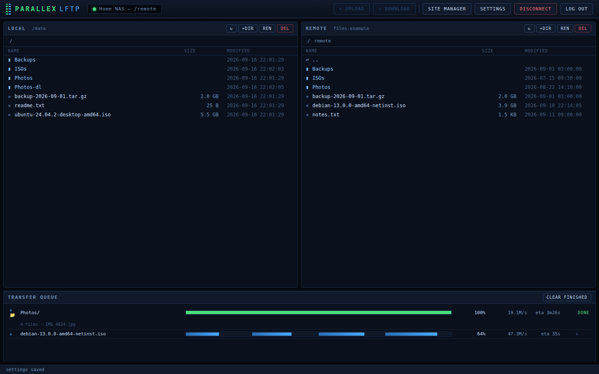

# parallex-lftp
total AI slop, but it works and is free. uploading is fucked but that is not what this is for lol.  
A dual-pane file browser that runs as a web app in Docker,
using [`lftp`](https://lftp.yar.ru/) as the transfer engine. Supports
**FTP, FTPS, and SFTP**, with real parallel segmented downloads via lftp's
native `pget -n <segments>`.



## Features

- **Dual-pane browsing** — local (a mounted Docker volume) on the left,
  remote server on the right, with clickable breadcrumb navigation
- **Site Manager** — saved connection profiles (host, protocol,
  credentials, initial directories, optional per-site thread/segment
  overrides), stored in `config/sites.json`
- **Transfer settings** — concurrent transfer count, segments per file,
  minimum file size before segmenting kicks in, optional bandwidth cap
- **Segmented parallel downloads** — large downloads use `pget -n
  <segments>` for multi-connection transfers (uploads use plain `put`;
  lftp has no segmented upload for a single file)
- **Folder transfers** — select a directory and download/upload the whole
  tree recursively (`mirror`), with parallel files and live progress on
  folder downloads, including the current file and a running file count
  (mirror runs `--verbose`, so `docker logs` shows each file too)
- **Live transfer queue** — per-file segment fill visualization, percent,
  speed, and ETA streamed over WebSocket
- **Multi-select** — shift-click for a range, ctrl/cmd-click to toggle;
  download, upload, and delete act on every selected file/folder at once
- **File operations** — mkdir / rename / delete on both local and remote
- **Themes** — Rack Amber (default), Retro Green (black/green phosphor),
  and Deep Blue, switchable from Settings; the choice is saved with your
  account and applied instantly
- **Credential hygiene** — site passwords are encrypted at rest
  (AES-256-GCM) in `config/sites.json`, passed to lftp over stdin (never
  CLI args, so they don't show in `ps`), and anything logged or returned
  to the browser is run through a redaction pass

## Screenshots

| Site Manager | Settings |
|---|---|
|  |  |

| Retro Green theme | Deep Blue theme |
|---|---|
|  |  |

## Running it

```bash
docker compose up --build
# open http://localhost:7609
```

Volumes:

| Host | Container | Purpose |
|---|---|---|
| `./data` | `/data` | What the LOCAL pane browses |
| `./config` | `/config` | `sites.json`, `settings.json`, SSH `known_hosts` |

## Docker Compose (full example)

A complete `docker-compose.yml` with every usable setting spelled out.
Values shown are the defaults — drop any line you don't need, or move the
secrets into a `.env` file (recommended, see below):

```yaml
services:
  parallex-lftp:
    build: .                       # or use a prebuilt image reference here
    container_name: parallex-lftp
    ports:
      - "7609:7609"                # host:container — change the LEFT side
                                   # to serve on a different host port
    volumes:
      # what the LOCAL pane browses; downloads land here
      - ./data:/data
      # persistent state: sites.json, settings.json, auth.json,
      # .secret (encryption keyfile) and .ssh/known_hosts
      - ./config:/config
    environment:
      # ---- file ownership -------------------------------------------
      # run as this uid:gid so downloads are editable on the host
      # without sudo (find yours with `id -u` / `id -g`)
      - PUID=1000
      - PGID=1000
      # permission mask for new files: 022 -> 644/755,
      # 002 -> group-writable 664/775
      - UMASK=022
      # ---- credential encryption ------------------------------------
      # key source for encrypting saved site passwords; when set, the
      # key never touches ./config. Unset -> auto keyfile at
      # ./config/.secret instead
      - PARALLEX_SECRET=change-me-to-something-long-and-random
      # ---- web-UI account (optional seed) ----------------------------
      # creates the single account at first boot (values are hashed,
      # never stored as-is; ignored once an account exists). Leave both
      # unset to use the first-run setup screen in the browser instead
      - AUTH_USERNAME=admin
      - AUTH_PASSWORD=a-good-password
    restart: unless-stopped
```

With a `.env` file next to the compose file (compose reads it
automatically), the compose entries can stay as pass-throughs — which is
exactly what this repo's checked-in `docker-compose.yml` does:

```yaml
    environment:
      - PUID=${PUID:-1000}
      - PGID=${PGID:-1000}
      - UMASK=${UMASK:-022}
      - PARALLEX_SECRET=${PARALLEX_SECRET:-}
      - AUTH_USERNAME=${AUTH_USERNAME:-}
      - AUTH_PASSWORD=${AUTH_PASSWORD:-}
```

## Deploying on Unraid

Unraid's Docker manager wants a prebuilt image plus a template — both are
provided. Every push to `main` publishes
`ghcr.io/r0me/parallex-lftp:latest` (amd64 + arm64) via GitHub Actions.

**Install the template** (current Unraid steers user templates to the
flash drive's `templates-user` folder, so drop the file there and it shows
up in the Add Container dropdown):

1. Download the template file:
   ```
   https://raw.githubusercontent.com/r0me/parallex-lftp/main/templates/my-parallex-lftp.xml
   ```
2. Copy `my-parallex-lftp.xml` onto the Unraid flash drive at
   `config/plugins/dockerMan/templates-user/`, either way:
   - **SMB** — browse to `\\TOWER\flash\config\plugins\dockerMan\templates-user\`
     and drop the file in (enable the *flash* share's SMB export first if
     it's off: Main → Flash → *Export: Yes*).
   - **SSH / console** — the flash is mounted at `/boot`, so:
     ```
     scp my-parallex-lftp.xml root@TOWER:/boot/config/plugins/dockerMan/templates-user/
     ```
3. Unraid web UI → **Docker** tab → **Add Container** → pick
   **parallex-lftp** from the **Template** dropdown (your user templates
   are at the top). Then:

5. Pick the share the LOCAL pane should browse for **/data**
   (default `/mnt/user/downloads/`); **/config** defaults to
   `/mnt/user/appdata/parallex-lftp/`.
6. Defaults are Unraid-native: `PUID=99` / `PGID=100` (`nobody:users`),
   so downloads are editable over SMB like any other share file. Set
   `UMASK=000` or `002` if other share users need write access too.
7. Optionally fill `PARALLEX_SECRET` (recommended) and
   `AUTH_USERNAME`/`AUTH_PASSWORD`, or just create the account in the
   browser on first visit. Start the container → `http://SERVER-IP:7609`.

**Alternative: Compose Manager plugin** — install "Compose.Manager" from
Community Applications, point a new stack at this repo's
`docker-compose.yml`, and it builds the image on the box instead of
pulling from GHCR. Works, but you lose the Docker-tab niceties (icon,
WebUI button, update checks).

## Configuration

All settings are environment variables. The easiest way to set them is a
`.env` file next to `docker-compose.yml` — compose picks it up
automatically and none of the values end up in the compose file itself:

```bash
# .env
PUID=1000
PGID=1000
PARALLEX_SECRET=change-me-to-something-long-and-random
AUTH_USERNAME=admin
AUTH_PASSWORD=a-good-password
```

| Variable | Default | Meaning |
|---|---|---|
| `PORT` | `7609` | HTTP/WebSocket listen port inside the container. Change the host-side mapping in `docker-compose.yml` (`ports:`) rather than this. |
| `LOCAL_ROOT` | `/data` | Sandbox root for the LOCAL pane. Everything the browser shows and every transfer target lives under here; paths outside it are rejected. Mapped from `./data` on the host by compose. |
| `CONFIG_DIR` | `/config` | Persistent state: `sites.json` (saved sites), `settings.json` (transfer tuning), `auth.json` (web-UI account), `.secret` (auto-generated encryption key, if used), and `.ssh/known_hosts` (trusted SFTP host keys). Mapped from `./config` on the host. |
| `PUID` | `1000` | Uid the app runs as after the entrypoint drops root. Files it creates (downloads, config) are owned by this uid on the host, so set it to your own user (`id -u`) to make downloads editable without sudo. |
| `PGID` | `1000` | Gid the app runs as — pair of `PUID`; find yours with `id -g`. |
| `UMASK` | `022` | Permission mask for newly created files. `022` → files `644` / dirs `755` (group+others read-only). Use `002` if a shared group should also be able to write. |
| `PARALLEX_SECRET` | *(unset)* | Secret behind the at-rest encryption of site passwords in `sites.json`. When set, the AES key is derived from it (scrypt) and **never touches the `./config` volume** — recommended. When unset, a random keyfile is generated at `config/.secret` (mode 600) instead. Setting it later is safe: existing values are transparently re-encrypted under the new key at next boot. If you change it *and* delete the keyfile, saved passwords become unreadable and connect returns a clear error asking you to re-enter them. |
| `AUTH_USERNAME` | *(unset)* | Optional: seed the single web-UI account at first boot. Only used while no account exists yet (i.e. no `config/auth.json`); ignored afterwards. If unset, the UI shows a one-time create-account screen instead. |
| `AUTH_PASSWORD` | *(unset)* | Password for the seeded account, min 8 characters. It is scrypt-hashed into `config/auth.json` at boot — the plaintext is never stored. |

## Authentication

The web UI is protected by a single local account:

- **First run**: the UI shows a create-account screen (username +
  password, min 8 chars). Alternatively seed it via
  `AUTH_USERNAME`/`AUTH_PASSWORD` (see Configuration) — handy for
  fully scripted deployments.
- **Sessions**: a signed, httpOnly cookie valid for 7 days; it survives
  container restarts. Logging out clears it, and changing the password
  invalidates every previously issued session.
- **Locked out?** Delete `config/auth.json` on the host and restart the
  container — you're back at the create-account screen. (Anyone with
  access to the config volume can do the same, which matches the
  existing at-rest threat model.)
- **Exposure note**: traffic is plain HTTP, so the password and cookie
  are visible on the wire to anyone in-path. On a trusted LAN that's
  usually fine; for anything beyond that, put a TLS-terminating reverse
  proxy in front. Login attempts are rate-damped, but this is
  homelab-grade auth, not a hardened public-facing gateway.

## File ownership (PUID/PGID)

The container drops from root to `PUID:PGID` (default `1000:1000`) before
starting the app, so downloaded files land in `./data` owned by that
uid/gid — editable on the host without sudo. Set them to your own user:

```bash
# find your ids
id -u   # -> PUID
id -g   # -> PGID

# either export them, or put them in a .env file next to docker-compose.yml:
#   PUID=1000
#   PGID=1000
PUID=$(id -u) PGID=$(id -g) docker compose up --build
```

`UMASK` (default `022`) controls the permission bits on newly created
files; use `002` if a shared group should also get write access. The
entrypoint also chowns `./config` (sites, settings, known_hosts) to
`PUID:PGID`, but never touches ownership inside `./data`.

## SSH host keys (SFTP)

There's no TTY in the container to answer lftp's interactive host-key
prompt, so SFTP uses **trust-on-first-use** (`sftp:auto-confirm yes`).
`HOME` points at the `/config` volume, so an accepted key lands in
`config/.ssh/known_hosts` and survives container rebuilds. A key that
*changes* on an already-trusted host is still rejected.

## Known caveats

- **Auth is homelab-grade and HTTP-only.** The login gate keeps casual
  LAN visitors out, but without TLS the credentials and session cookie
  travel in cleartext — front it with a TLS reverse proxy before exposing
  it beyond your own network.
- **Credential encryption is at-rest, not end-to-end.** Site passwords in
  `config/sites.json` are AES-256-GCM encrypted. The key comes from the
  `PARALLEX_SECRET` env var when set (recommended — put it in a `.env`
  file; the key then never touches the `config/` volume), otherwise from
  an auto-generated `config/.secret` keyfile (mode 600). Existing
  plaintext files are migrated automatically on boot, and setting
  `PARALLEX_SECRET` later transparently re-encrypts. Someone with both
  the config folder **and** the secret can still decrypt — this protects
  a leaked/backed-up/committed `sites.json`, not a fully compromised
  host. (`config/` and `data/` are gitignored regardless.)
- **SSH key auth isn't wired up yet** — the schema/UI has a spot for it
  (`authType: 'key'`), but only password auth works end-to-end.
- **lftp's progress-meter text can vary by version.** If live progress
  stops updating after changing the base image, check `docker logs` for
  the actual meter line and adjust `PROGRESS_RE` in
  `server/transferManager.js`.
- **No drag-and-drop** — transfers go through the toolbar Upload/Download
  buttons acting on the current selection.
- Trust-on-first-use means the very first key seen for a host is accepted
  automatically — a normal homelab-scale tradeoff.

## Development

```bash
npm install
LOCAL_ROOT=./data CONFIG_DIR=./config PORT=7609 npm start
```

Requires `lftp` on the PATH (and `openssh-client` for SFTP).
